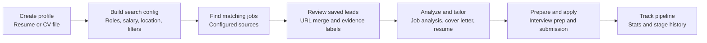
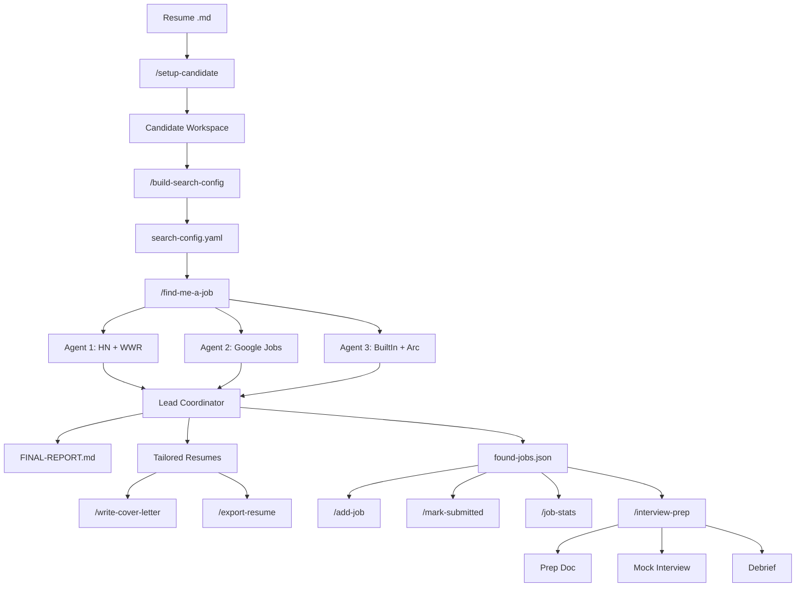

# Hire Me Agents Console

I got laid off and built a robot army to find my next job.

This fork preserves the original nine job-search prompts and adds a local web console that can use [OpenRouter](https://openrouter.ai/), Claude, ChatGPT, DeepSeek, Kimi, Gemini, [Routera](https://www.routera.one/), or any public OpenAI-compatible provider. Choose a provider and model once in Settings; setup, search planning, job analysis, resume tailoring, cover letters, interview prep, and reporting all use the saved selection.

Provider keys are handled by the local Express server and saved to Git-ignored settings files. They are never compiled into the browser bundle. Profiles and application history are stored locally; selected CV/profile content is sent to the provider chosen in Settings when an AI workflow runs.

## Web Console Quick Start

### Prerequisites

- Node.js 20+
- An API key for at least one supported provider: [OpenRouter](https://openrouter.ai/keys), [Anthropic](https://console.anthropic.com/settings/keys), [OpenAI](https://platform.openai.com/api-keys), [DeepSeek](https://platform.deepseek.com/api_keys), [Moonshot/Kimi](https://platform.kimi.ai/console/api-keys), [Google AI Studio](https://aistudio.google.com/app/apikey), or [Routera](https://www.routera.one/)

### Run locally

```bash
npm install
npm run dev
```

Open `http://127.0.0.1:5173`, select **Settings**, choose a provider, enter its key, choose a model, and save. OpenRouter and Routera load their model catalogs live; OpenRouter is the only provider with the built-in web-search/fetch tools. For a provider that is not listed, choose **Custom provider** and enter its public OpenAI-compatible base URL, API key, and model ID.

```bash
OPENROUTER_API_KEY=sk-or-v1-... npm run dev
```

### Accounts and sign-in

The web console requires an account. **Create a local account** with an email address and password, or sign in with Google when Google OAuth is configured. Passwords are stored as salted scrypt hashes and sessions use an HttpOnly cookie. Profiles and settings are scoped to the signed-in account, so users sharing one deployment cannot read each other's data.

For Railway, add these variables to the service:

```text
OPENROUTER_API_KEY=your-openrouter-key
ANTHROPIC_API_KEY=your-anthropic-key
OPENAI_API_KEY=your-openai-key
DEEPSEEK_API_KEY=your-deepseek-key
MOONSHOT_API_KEY=your-kimi-key
GEMINI_API_KEY=your-gemini-key
ROUTERA_API_KEY=your-routera-key
HMA_DATA_DIR=/data
# Optional override for a regional Kimi-compatible endpoint
KIMI_API_BASE_URL=https://api.moonshot.ai/v1
```

Provider variables are optional; add only the providers you want to make available. A signed-in user can also save a provider key in Settings. Saved keys are stored per account under `.data/users/<account-id>/settings.json` and take precedence over environment keys. Environment variables are fallback keys for accounts without a saved key and are never written to account files. The older single `apiKey` setting is migrated to `providerKeys.openrouter` automatically. Direct provider model lists are conservative server-owned defaults and can be updated in `server/settings.js`; OpenRouter and Routera models are loaded live from their compatible `/models` endpoints after a key is configured. Custom provider URLs must be public HTTP or HTTPS endpoints; private-network targets are blocked before requests are made. OpenRouter is currently the only provider that supports the job-search web tools.

Attach a Railway Volume mounted at `/data` so accounts, profiles, settings, sessions, and application history survive redeployments. `PORT` is provided by Railway automatically.

Google sign-in is optional. Add `GOOGLE_CLIENT_ID` and `GOOGLE_CLIENT_SECRET`, then register this callback URL in the Google Cloud OAuth client:

```text
https://your-public-domain.example/api/auth/google/callback
```

Set `APP_ORIGIN=https://your-public-domain.example` for a stable public origin. You may set `GOOGLE_REDIRECT_URI` explicitly when the registered callback URL differs from the public origin. Never commit these secrets or expose the client secret to the browser.

To designate administrators, set a comma- or space-separated `ADMIN_EMAILS` variable, for example `ADMIN_EMAILS=fredanaman@gmail.com`. The signed-in account receives the `admin` role when its email matches this list.

For a production build:

```bash
npm run build
npm start
```

The production server listens on `http://127.0.0.1:8787` by default. Set `PORT` to override it.

### Settings

Settings are persisted per signed-in account in `.data/users/<account-id>/settings.json` and apply to every agent workflow:

- Selected provider: OpenRouter, Claude, ChatGPT, DeepSeek, Kimi, Gemini, Routera, or a custom OpenAI-compatible provider
- Provider-specific API key status (raw keys are never returned by the API)
- OpenRouter model slug selected from the live `/api/v1/models` catalog, or a server-owned direct-provider model list
- Temperature
- Maximum output tokens
- Default job-search sources used by Step 3
- Optional locally stored API key

Use **Test saved model** after saving to verify the selected model and key together.

The **Setup profile** workflow accepts Markdown, TXT, PDF, and DOCX resumes up to 10 MB. Uploaded files are parsed by the local server and remain editable in the source-material field before the agent runs.

Profiles are reusable and isolated: each stores its own CV text, target role types, custom search sites, active selection, and nine-step workflow progress in the signed-in account's `.data/users/<account-id>/profiles.json` file. Browser storage provides an immediate local cache and existing browser-only profiles are migrated to the local file automatically. Switch the active profile from the homepage before starting a workflow.

For isolated development or browser testing, set `HMA_DATA_DIR` to a separate writable directory. The profile and settings stores use that directory while prompts and the built app remain rooted in the project.

The ten built-in sources are shared defaults configured in **Settings → Default job-search sources**. Each profile can also have up to 20 custom domains or careers-page URLs, managed only inside **Step 3 → Find matching jobs**. Step 3 combines the saved profile and Step 2 search configuration with the default and profile-specific sources before starting the live search.

Jobs discovered by Step 3 are saved to the active profile and merged by canonical posting URL, so a new search preserves pipeline stages, notes, and saved workflow artifacts. Each lead is labelled **Page fetched**, **Unavailable**, **Previously checked**, or **Unverified**. A fetched page is evidence that the URL could be read; it is not an independent claim that the vacancy is still accepting applications. Steps 4 and 5 provide a picker for those jobs, with a **Not interested** action that records a dismissal so the same listing is not re-added on the next search.

The Pipeline page is backed by the saved job records and includes New, Submitted, Interviewing, Offered, Closed / Rejected, and Withdrawn stages. Track submission and pipeline stats run locally and do not require an OpenRouter request. Profile backups can be exported and restored from the Profiles page.

## How the Web App Works

The web console turns a CV into a repeatable job-search workspace. Each profile keeps its own resume, target roles, search settings, saved jobs, workflow results, application stages, notes, and generated materials.



1. **Create or select a profile.** Upload a Markdown, TXT, PDF, or DOCX CV, or paste the text directly. The local server extracts the source material and stores it with the selected profile.
2. **Build the search configuration.** The selected provider and model turn the profile into target roles, salary expectations, location preferences, exclusions, and search priorities. Review the result before searching.
3. **Find matching jobs.** Step 3 combines the saved configuration with the default sources and any custom careers pages for that profile. The server runs the source searches, returns structured job leads, and saves them by canonical posting URL so repeated searches do not create duplicate records.
4. **Check the evidence.** Each lead shows whether its page was fetched, unavailable, previously checked, or unverified. A fetched page confirms that the URL could be read; it does not guarantee that the employer is still accepting applications.
5. **Generate application material.** Select a saved role for analysis, a tailored cover letter, interview preparation, or resume export. The generated result is stored as an artifact on that job so it can be revisited from the profile or pipeline.
6. **Track applications.** Move a role through New, Submitted, Interviewing, Offered, Closed / Rejected, or Withdrawn. Stage changes and notes are saved locally, and pipeline statistics are calculated without another AI request.
7. **Back up the workspace.** Export profiles to JSON for safekeeping and restore them on another local copy of the app. Set `HMA_DATA_DIR` when you want the profile and settings files in a separate directory.

The browser talks to the local Express server. Provider keys stay on that server, while the selected CV/profile context is sent only to the provider selected in Settings when an AI workflow runs. OpenRouter handles the live web-search/fetch tools; direct providers receive the text prompt without those tools. Profiles, jobs, stages, and artifacts remain in the local data store unless you export or copy them yourself.

## Original Claude Code Commands

The original `.claude/commands/` files remain available for people who want the prompt-only Claude Code workflow described below.

## Why This Exists

I built this the day I got laid off. Within 30 minutes of the call, I was designing the architecture. I got an interview within two weeks of my first application found with this team. I open-sourced it because if it works for me, it should work for anyone.

## How the Original Command Workflow Works



You provide a markdown resume. The system bootstraps a workspace, generates search preferences, spawns parallel agents across job boards, scores every match against a 6-dimension rubric, generates per-job tailored resumes optimized for each company's ATS platform, and compiles everything into a structured report. From there, you can add jobs manually, generate cover letters, export to DOCX, track applications, pull unemployment reporting data, or run full interview prep with mock sessions.

## Features

- **Multi-agent parallel search** — 3-5 agents searching different sources simultaneously (HN Who's Hiring, We Work Remotely, Google Jobs aggregation, Built In, Arc.dev, direct career pages)
- **6-dimension scoring rubric** — Stack Match (30%), Experience Fit (20%), Company Stability (15%), Comp Range (15%), Remote/Location (10%), Role Type (10%)
- **ATS platform detection** — Identifies Greenhouse, Ashby, Lever, Workday, iCIMS, Taleo and applies per-platform keyword strategy
- **Per-job tailored resumes** — Rewrites summary, reorders skills, adjusts experience bullets, preserves exact contact info. ATS keyword optimization mirrors listing terminology verbatim.
- **Cover letter generation** — Culture signal detection, gap analysis, self-check rubric. Not "write me a cover letter" — a reasoning system that mirrors the listing's language and addresses mismatches honestly.
- **Interview prep pipeline** — Company research, predicted questions with STAR-format answers from real resume experience, gap analysis with objection handling, AI & modern tooling positioning, salary negotiation strategy
- **Interactive mock interviews** — Three difficulty levels (standard, tough, gauntlet). Real-time scoring, immediate feedback, follow-up questions. Gauntlet mode is deliberately adversarial.
- **Post-interview debrief** — Analyzes what interviewers were evaluating, compares actual questions against predictions, drafts follow-up email key lines
- **Application tracking** — Full status lifecycle (new, submitted, interviewing, offered, rejected, withdrawn) with timestamped history
- **Unemployment reporting** — Generates weekly certification form data with company address lookup. Uniquely practical.
- **Multi-candidate support** — Isolated workspaces per person. Run searches for multiple candidates without interference.

## Claude Code Quick Start

### Prerequisites

- [Claude Code](https://claude.ai/code) CLI installed and authenticated
- A resume in markdown format
- Python 3 + `pip install python-docx` (optional — only needed for `/export-resume` DOCX conversion)

### Install

```bash
git clone https://github.com/dominiceloe/hire-me-agents.git
```

> **Important:** Claude Code must be launched from inside the `hire-me-agents/` directory for the slash commands to be available. The commands are defined in `.claude/commands/` and Claude Code only picks them up when you start a session from the repo root.

### Run

```bash
# Start Claude Code from the repo directory
cd hire-me-agents
claude

# 1. Set up a candidate workspace
/setup-candidate --resume ~/Desktop/my-resume.md

# 2. Generate search preferences from resume analysis
/build-search-config --resume ~/job-search-candidates/your-name/resume-base.md

# 3. Review and edit search-config.yaml, then launch the search
/find-me-a-job --resume ~/job-search-candidates/your-name/resume-base.md --config ~/job-search-candidates/your-name/search-config.yaml
```

Output lands in `~/job-search-candidates/your-name/runs/`. Open `FINAL-REPORT.md` for the full analysis.

## Commands Reference

| Command | Description | Key Flags |
|---------|-------------|-----------|
| `/setup-candidate` | Bootstrap workspace from a resume | `--resume` (required), `--config`, `--root`, `--name` |
| `/build-search-config` | Auto-generate search preferences | `--resume` (required), `--output`, `--strict`, `--loose` |
| `/find-me-a-job` | Multi-agent parallel job search | `--resume` (required), `--config`, `--agents 3-5`, `--threshold`, `--duration` |
| `/add-job` | Manually add a job from a URL | `--candidate` `--url` (required), `--company`, `--role`, `--comp`, `--note` |
| `/write-cover-letter` | Generate tailored cover letter | `--candidate` `--job` (required), `--tone`, `--points`, `--no-filler` |
| `/export-resume` | Convert markdown resume to .docx | `--resume` (required), `--output` |
| `/mark-submitted` | Update application status | `--candidate` `--job` (required), `--status`, `--note` |
| `/job-stats` | Pipeline stats + unemployment data | `--candidate` (required), `--week`, `--all`, `--export` |
| `/interview-prep` | Prep doc, mock interview, or debrief | `--candidate` `--job` (required), `--prep`/`--mock`/`--debrief`, `--difficulty`, `--rounds` |

## Architecture

### Agent Model

`/find-me-a-job` spawns 3-5 parallel search agents using Claude Code's Task tool. Each agent:

- Receives the full resume, candidate profile, search config, scoring rubric, and dedup list in its prompt (agents are self-contained — they can't read files created by the coordinator)
- Searches its assigned job sources (HN, WWR, Google Jobs, etc.)
- Scores every found job against the 6-dimension rubric
- Generates tailored resume + cover letter + application instructions for qualifying jobs
- Writes results to its own `agent-{N}-results.json` file (no shared file writes)

The lead coordinator merges all agent results, deduplicates cross-agent matches, updates the cumulative ledger, and generates FINAL-REPORT.md.

### Data Model

```
~/job-search-candidates/
├── candidate-a/
│   ├── resume-base.md           # Source of truth
│   ├── search-config.yaml       # Search preferences
│   ├── found-jobs.json          # Append-only job ledger
│   ├── candidate-profile.json   # Auto-extracted structured profile
│   ├── tailored-resumes/        # All tailored resumes
│   ├── applications/            # Application tracking
│   └── runs/                    # One folder per search run
│       └── run-2026-03-15-14-30/
│           ├── FINAL-REPORT.md
│           ├── agent-1-results.json
│           ├── agent-2-results.json
│           ├── agent-3-results.json
│           └── pinterest_sr-frontend-eng/
│               ├── job-details.md
│               ├── instructions.md
│               ├── resume-tailored.md
│               └── cover-letter.md
└── candidate-b/
    └── ...                      # Fully isolated workspace
```

### Scoring Rubric

| Dimension | Weight | What It Measures |
|-----------|--------|-----------------|
| Stack Match | 30% | How well the job's required technologies match the candidate's primary stack |
| Experience Fit | 20% | Whether the seniority level and years match |
| Company Stability | 15% | Company size and establishment as a proxy for stability |
| Comp Range | 15% | Whether listed compensation meets the candidate's target |
| Remote/Location | 10% | Remote availability and state eligibility |
| Role Type | 10% | Whether the role type (product eng, platform, infra) matches experience |

### ATS Intelligence

The system detects which ATS platform hosts each job listing and adjusts the tailored resume strategy:

- **Greenhouse / Ashby** (modern) — Recruiter-search based, not auto-filter. Keyword optimization helps recruiters find the candidate when searching.
- **Workday / iCIMS / Taleo** (legacy) — More likely to auto-filter by keyword matching. Exact keyword matching is critical. The tailored resume mirrors listing terminology verbatim.
- **High applicant volume (500+)** — ATS filtering more likely. Extra keyword emphasis.
- **Low applicant volume (<50)** — Human likely reads every resume. Optimize for readability and narrative.

## The Full Pipeline

```
Resume → Setup → Config → Search → Score → Tailor → Apply →
Interview Prep → Mock Interview → Debrief → Track → Stats
```

1. **Resume** — Start with a markdown resume
2. **Setup** (`/setup-candidate`) — Create isolated workspace, copy resume, initialize ledger
3. **Config** (`/build-search-config`) — Analyze resume, infer preferences, generate search-config.yaml
4. **Search** (`/find-me-a-job`) — Spawn parallel agents, search job boards, score matches
5. **Score** — 6-dimension rubric applied to every found job
6. **Tailor** — Per-job resumes with ATS-optimized keyword strategy
7. **Apply** — Review FINAL-REPORT.md, use tailored materials, submit applications
8. **Interview Prep** (`/interview-prep --prep`) — Company research, predicted questions, STAR answers, AI positioning
9. **Mock Interview** (`/interview-prep --mock`) — Interactive practice with three difficulty levels
10. **Debrief** (`/interview-prep --debrief`) — Post-interview analysis with follow-up email guidance
11. **Track** (`/mark-submitted`) — Update application status through the lifecycle
12. **Stats** (`/job-stats`) — Pipeline summary, weekly activity, unemployment certification data

## Configuration

`/build-search-config` generates a `search-config.yaml` from resume analysis. Key sections:

```yaml
preferences:
  remote_only: true
  min_salary: 120000
  experience_level_target: [mid, senior]

avoid:
  industries: [government, defense]
  keywords: ["security clearance", "polygraph"]
  companies: ["Previous Employer"]
  title_patterns: [intern, junior, director, VP]

prioritize:
  industries: [SaaS, fintech, developer tools]
  keywords: [Python, React, PostgreSQL]
  role_types: [product engineering, backend]

search:
  max_posting_age_days: 30
  include_no_salary: true
  target_sources: [hn_hiring, weworkremotely, greenhouse, lever]
```

Every value includes a comment explaining why it was chosen. Review and edit before running a search.

## Multi-Candidate Support

Each candidate gets a fully isolated workspace under `~/job-search-candidates/`. Run searches for different people without interference:

```bash
/setup-candidate --resume ~/resumes/alice.md --name alice-chen
/setup-candidate --resume ~/resumes/bob.md --name bob-park

# Each candidate has their own ledger, config, runs, and tailored materials
/find-me-a-job --resume ~/job-search-candidates/alice-chen/resume-base.md --config ~/job-search-candidates/alice-chen/search-config.yaml
/find-me-a-job --resume ~/job-search-candidates/bob-park/resume-base.md --config ~/job-search-candidates/bob-park/search-config.yaml
```

## Contributing

See [CONTRIBUTING.md](CONTRIBUTING.md) for how to add commands, job sources, and submit PRs.

## License

[MIT](LICENSE)
